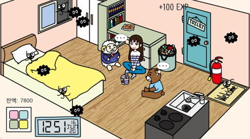

# :baby_chick:Projects
## :blossom:Contents
* :earth_asia:Web Services (front-end)
  - [2019 UDC 해커톤](#2019-udc-해커톤)
  - [2019 한전 해커톤](#2019-한전-해커톤)
  - [2019 Drunkare](#2019-drunkare)
  - [2020 VMOlab 홈페이지](#2020-vmolab-홈페이지-in-progress) `IN PROGRESS`
* :mag_right:Internship & Research
  - [2018 LG전자 인턴](#2018-lg전자-인턴)
  - [2018 대학원 인턴](#2018-대학원-인턴)
* :video_game:Game Development
  - [홈 어론](#홈-어론home-alone)
  - [하트 얌얌](#하트-얌얌hearts-yum-yum)
  - [귀여운 오목](#귀여운-오목)
  - [day by day](#day-by-day)

# :earth_asia:Web Services
## :bike:2019 UDC 해커톤

### Role
* 프론트엔드 개발 및 디자인 (Uikit 프레임워크, Leaflet 라이브러리 사용)
* Nodejs를 이용한 간단한 웹서버 구축 및 Ajax를 이용한 통신 구현
### Source Code
* Git : https://github.com/ricegood/portfolio/tree/master/works/mobicrypt-frontend

## :zap:2019 한전 해커톤

* See full demo here : https://youtu.be/3AgCQQ9CHHE
### Role
* 프론트엔드 개발 및 디자인 (오픈소스 Uniswap Frontend 사용)
* React 기반 프론트엔드
### Source Code
* Git : https://github.com/ricegood/portfolio/tree/master/works/uniswap-frontend

## :beer:2019 Drunkare

* See mobile demo here : https://youtu.be/bfvwVxhVxkI
### Role
* Drunkare 안드로이드 모바일 앱 및 웹앱(프론트엔드) 구현
* curl을 이용해 실시간으로 스마트워치 데이터를 전송하는 타이젠 어플리케이션 구현
### Source Code
* Git : https://github.com/snu-amp19-team1

## :mortar_board:2020 VMOlab 홈페이지 `IN PROGRESS`

### Role
* vuejs 프레임워크 기반 프론트엔드 작업
### Source Code
* Git : https://github.com/ricegood/onechain-explorer

# :mag_right:Internship & Research
## :hatching_chick:2018 LG전자 인턴
### Role
* Specification 문서 검증을 위한 Polyfill 개발 참여
* Spatial Navigation의 이점 및 Edge Case들을 나타낼 수 있는 Demo 페이지 제작 참여
### Documents
* Specification : https://www.w3.org/TR/css-nav-1/
* Demo : https://wicg.github.io/spatial-navigation/demo/
* Released Polyfill : https://www.npmjs.com/package/spatial-navigation-polyfill

## :memo:2018 대학원 인턴
### Role
* Solidity 컴파일러 최적화 기능 개선
* 같은 스마트 컨트랙트 코드를 작성하더라도 가스 소모량이 적은 바이트코드를 산출하게 함
### Paper
* Github : https://github.com/ricegood/solidity
* Paper : ["스마트 컨트랙트 비용 절감을 위한 Solidity Lint", KCC 2018](https://www.eiric.or.kr/literature/ser_view.php?SnxGubun=INME&mode=total&searchCate=literature&literature=Y&more=Y&research=Y&pg=115&gu=INME000F6&cmd=qryview&SnxIndxNum=215364&rownum=1143&totalCnt=4829&q1_t=&listUrl=L2xpdGVyYXR1cmUvcmVzdWx0LnBocD9TbnhHdWJ)

# :video_game:Game Development
## :house:홈 어론(Home Alone)

### Role
* 코어 클라이언트 개발 (친구 방문, 상점 및 아이템 기능, 이벤트 씬 등)
### Download & Source Code
* Play Store: https://play.google.com/store/apps/details?id=com.GDC.HomeAlone
* Github: https://github.com/SNUGDC/HomeAlone
### News
* [\[카드뉴스\] 놀러오세요! 소주맛 청춘들의 자취방](http://naver.me/5rCLa87W)
* [홈 어론 리뷰 자취방 속 동물 친구들, 대학 시절이 참 그립다!](http://naver.me/GiUW8PXQ)

## :kissing_heart:하트 얌얌(Hearts YUM-YUM)

* See full demo here: https://youtu.be/8Ql8mqpblP0
### Role
* 개인 프로젝트
* 기획 / 개발 / 아트
### Download & Source Code
* Download(window, mac): https://9yang.itch.io/hearts-yum-yum
* Github: https://github.com/ricegood/hearts-yum-yum

## :heart:귀여운 오목
 
### Role
* 개인 프로젝트
* 기획 / 개발 / 아트
### Download
* Download: https://drive.google.com/open?id=1J-jI6B6247s0gvsNEU78UqO9SW5l1ecg

## :calendar:day by day

### Role
* 개인 프로젝트
* 기획 / 개발 / 디자인
### Download
* Download: https://play.google.com/store/apps/details?id=com.gooyang.daybyday
